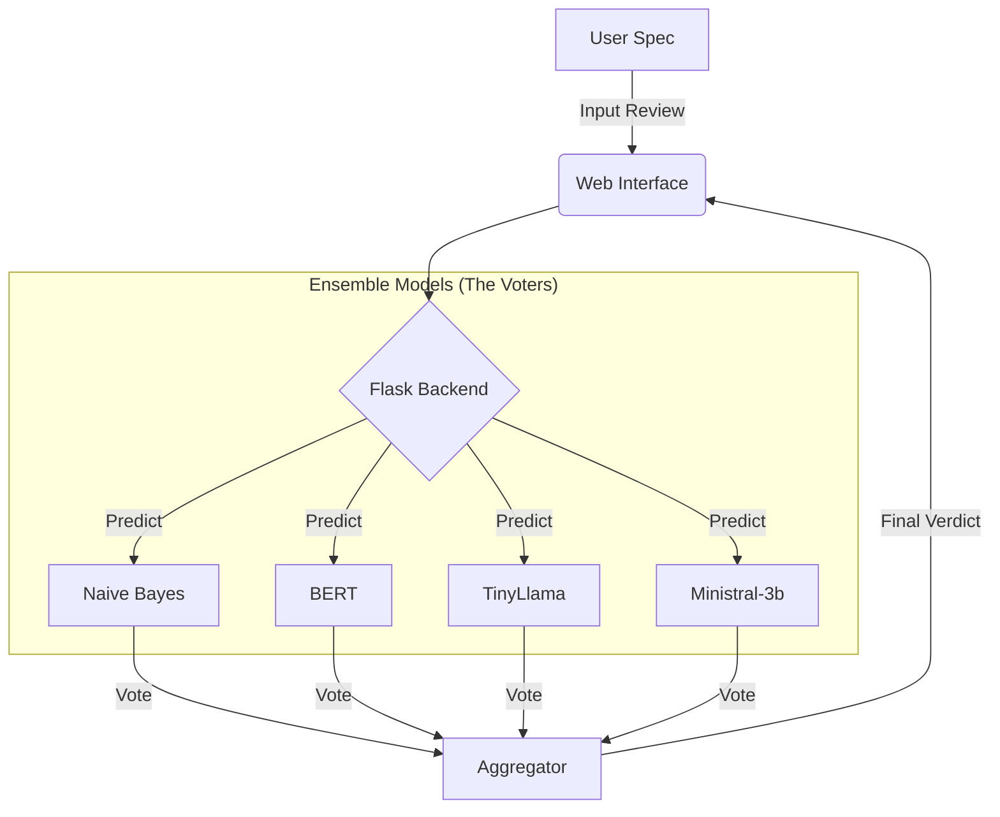

# Fake Review Detection System 🕵️‍♂️

## 📌 Project Overview
This application is a **Fake Review Detection System** designed to identify whether a product review was written by a human or generated by an AI. It leverages a powerful **Ensemble Voting Mechanism** that combines the predictions of multiple advanced models—including Large Language Models (LLMs), Transformers (BERT), and traditional Machine Learning algorithms (Naive Bayes)—to provide a highly accurate and robust verdict.

## 🏗️ System Architecture

### The Ensemble "Voting" System
Instead of relying on a single model, this system uses a "Majority Vote" approach. When you submit a review, the backend sends it to all *active* (trained) models. Each model casts a vote ("Real" or "Fake"), and the system aggregates these votes to determine the final classification and a confidence score.

### Data Flow
1.  **Dataset**: The system starts with the `Fake Review Dataset.csv`.
2.  **Model Training**: Independent scripts (e.g., `bert.py`, `naive_bayes.py`) read the dataset, train their specific model architecture, and save the "learned" patterns as artifacts (files or folders) to the disk.
3.  **The Backend (Voter)**: The Flask web application (`app.py`) starts up and checks for these saved artifacts. If found, it loads them into memory.
4.  **Prediction**: When a user submits text, the backend passes it to all loaded models, collects their outputs, and calculates the final result.



## 📂 Project Structure
*   **`models/`**: Contains the logic for each voter.
    *   `BERT/`: Contains `bert.py` (training script) and `saved_model/` (after training).
    *   `Naive_Bayes/`: Contains `naive_bayes.py` and `saved_model/`.
    *   ... (and others)
*   **`webapp/`**: The user interface.
    *   `app.py`: The main server that runs the voting logic.
    *   `templates/`: HTML files for the website.
*   **`Datasets/`**: Location of the training data.

---

## � Step-by-Step Execution Guide

### 1. Prerequisites
Ensure you have Python installed. Install the required dependencies:
```bash
pip install torch transformers pandas scikit-learn lime seaborn matplotlib flask
```

### 2. Train the Models (CRITICAL STEP)
**The application does not come with pre-trained brains.** You must train at least one model before using the app.

*   **To train Naive Bayes (Recommended for speed):**
    ```bash
    python models/Naive_Bayes/naive_bayes.py
    ```
    *This will create a `.pkl` file in `models/Naive_Bayes/saved_model/`.*

*   **To train BERT (High accuracy, slower training):**
    ```bash
    python models/BERT/bert.py
    ```
    *This will create a model folder in `models/BERT/saved_model/`.*

*Repeat for any other models you wish to include in the vote.*

### 3. Run the Application
Once you have trained at least one model, launch the web interface:

```bash
python webapp/app.py
```

You should see output indicating the server is running (usually on `http://127.0.0.1:5000`).

### 4. Use the Interface
1.  Open your browser to [http://127.0.0.1:5000](http://127.0.0.1:5000).
2.  Check the **"Active Models"** list at the top. It should show the models you trained in Step 2.
3.  Paste a review into the text box and click **Analyze**.
4.  View the **Ensemble Verdict** and the individual votes from each model.
